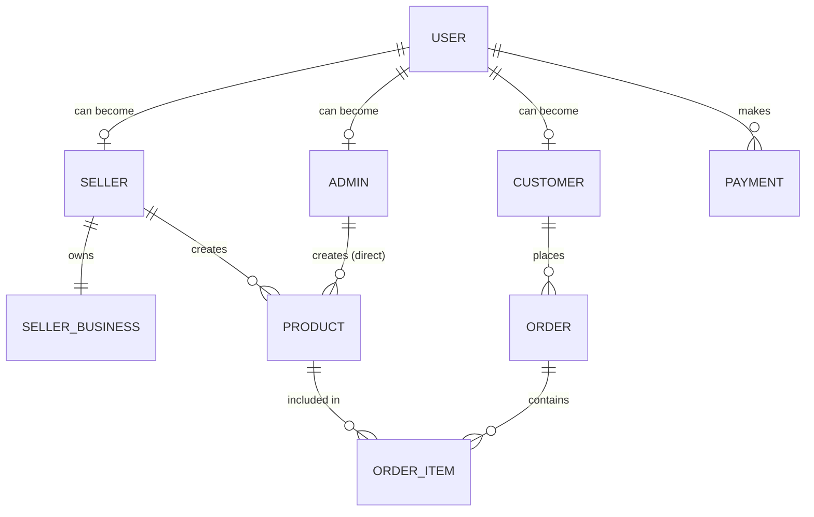
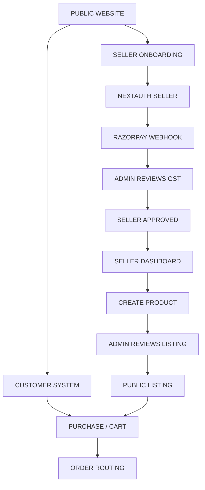

# EkoraBazaar Seller & Admin System Plan

## 1. Executive Summary

The EkoraBazaar platform connects customers with creators selling formulations and bases. The future business flow is:
Customer discovers products → Seller joins EkoraBazaar → Completes onboarding → Pays onboarding fee → Submits GST & business info → Admin reviews & verifies GST → Admin approves seller → Approved seller accesses dashboard → Seller creates listing → Admin approves listing → Listing goes public → Customer purchases → Orders managed via dashboard.

Currently, EkoraBazaar functions as a static storefront and lead-generation tool. The seller onboarding frontend exists, but the backend is rudimentary (saving to local JSON files), with no authentication, database, or admin interface. This document outlines the complete architecture to transition EkoraBazaar into a fully functional, secure, multi-sided marketplace.

---

## 2. CURRENT IMPLEMENTATION AUDIT

| Area | Current Status | Existing Files | What Exists | What Is Missing |
|---|---|---|---|---|
| **Customer** | Partially implemented | `/shop`, `/products/*` | Static product browsing | Cart, Checkout, Auth, Real DB fetch |
| **Seller** | Partially implemented | `/start-selling/*`, `api/seller-application` | Onboarding UI, File upload (Firebase), API to JSON | Auth, Dashboard, Real DB, Real Payments |
| **Admin** | Missing | N/A | Nothing | Auth, Dashboard, Verification workflows |
| **Authentication**| Missing | N/A | Nothing | NextAuth / Auth0, Roles, Password hashing |
| **Database** | Temporary | `applications.json`, `products.json` | Local JSON append | Real DB (PostgreSQL) |
| **Products** | Temporary | `mockProducts.ts`, `api/products` | Mock JSON rendering | DB schema, CRUD, Admin review |
| **Listings** | Missing | N/A | Nothing | Drafts, Approval workflow |
| **Cart** | Missing | N/A | Nothing | State, DB integration |
| **Checkout** | Missing | N/A | Nothing | Flow, Payment integration |
| **Payment** | Missing | `StepPayment.tsx` | UI mock | Gateway integration (Razorpay/Stripe) |
| **Orders** | Missing | N/A | Nothing | Order management, Tracking |
| **GST** | Partially implemented | `StepGST.tsx` | File upload to Firebase | Admin verification workflow |
| **Seller approval**| Missing | N/A | Nothing | Admin interface, State machine |
| **Listing approval**| Missing | N/A | Nothing | Admin interface, State machine |
| **Admin direct listing**| Missing | N/A | Nothing | Role-based creation bypass |
| **File storage** | Implemented | `firebase.ts` | Upload to Firebase Storage | Secure private storage rules |

---

## 3. RECOMMENDED SYSTEM ARCHITECTURE

**Current Stack:** Next.js (App Router), React, Tailwind CSS, Firebase Storage (Documents).
**Recommended Architecture:**
- **Frontend:** Next.js Server & Client Components
- **API:** Next.js API Routes (Route Handlers)
- **Authentication:** NextAuth.js (Auth.js) - Session-based, supporting JWT.
- **Business Logic:** Next.js Server Actions / Services layer
- **Database:** PostgreSQL (via Prisma ORM)
- **Storage:** 
  - Firebase Storage (Private) for GST/Identity docs.
  - AWS S3 / Cloudflare R2 (Public) for Product Images.
- **External Services:** Razorpay/Stripe for Payments, Nodemailer/Resend for Emails.

Minimal changes: Keep the frontend and API route structure, replace local JSON writes with Prisma/PostgreSQL, add NextAuth for login, and build the protected dashboards.

---

## 4. DATABASE DECISION

**Recommended Database: PostgreSQL**
**Why:**
EkoraBazaar is a marketplace with highly relational data: Users, Sellers, Products, Orders, Payments, and Approvals. PostgreSQL provides ACID compliance, strong data integrity (foreign keys, constraints), and excellent performance for complex joins (e.g., fetching a customer's order containing products from multiple sellers). 
**Why not the alternatives:**
- *MongoDB:* NoSQL is poor for marketplaces where data is highly structured and relational (orders linking to users and products).
- *MySQL:* Good, but PostgreSQL offers better JSONB support (useful for dynamic product attributes) and stricter typing.
- *Firebase/Firestore:* Hard to query complex relational data (e.g., "All pending products for sellers who are verified").

---

## 5. DATABASE ARCHITECTURE

**Entities (Prisma Schema concept):**

1. `users`
   - Purpose: Base authentication table for all humans.
   - Primary Key: `id`
   - Fields: `email`, `password_hash`, `role` (ADMIN, SELLER, CUSTOMER), `status`, `created_at`
2. `sellers`
   - Purpose: Seller specific profile.
   - Primary Key: `id` (EKO-SELL-XXXXXX)
   - Foreign Key: `user_id` -> `users.id`
   - Fields: `brand_name`, `status` (PENDING, APPROVED, REJECTED), `payment_status`
3. `seller_business_details`
   - Purpose: KYC and GST details.
   - Primary Key: `id`
   - Foreign Key: `seller_id` -> `sellers.id`
   - Fields: `gstin`, `legal_name`, `business_type`, `address`, `document_urls`
4. `products`
   - Purpose: The actual items being sold.
   - Primary Key: `id`
   - Foreign Key: `seller_id` -> `sellers.id`, `created_by_admin_id` -> `users.id` (nullable)
   - Fields: `title`, `description`, `price`, `stock`, `status` (DRAFT, PENDING_APPROVAL, PUBLISHED, REJECTED), `rejection_reason`
5. `orders` & `order_items`
   - Purpose: Customer purchases.
   - Foreign Keys: `customer_id` -> `users.id`, `product_id` -> `products.id`
6. `payments`
   - Purpose: Track seller onboarding fees and customer checkouts.
   - Fields: `transaction_id`, `amount`, `status`, `type` (ONBOARDING, ORDER)
7. `audit_logs`
   - Purpose: Track admin actions.
   - Fields: `admin_id`, `action`, `target_type`, `target_id`, `changes`, `created_at`

---

## 6. DATABASE RELATIONSHIP DIAGRAM



---

## 7. USER TYPES

1. **Customer**
   - **Can:** Browse, search, view products, add to cart, checkout, view own orders, manage profile.
   - **Cannot:** Access seller/admin dashboards, create products.
2. **Seller**
   - **Can:** Complete onboarding, submit GST, view verification status, manage profile, create products (draft/submit), edit rejected listings, view own sales/analytics, manage own orders.
   - **Cannot:** Approve listings, view other sellers' data, bypass approval workflows.
3. **Admin**
   - **Can:** Manage sellers, verify GST, approve/reject sellers, review/approve/reject listings, manage orders/payments, view platform analytics, suspend users, create direct products.
   - **Cannot:** Purchase products as a customer (should use a separate customer account), alter audit logs.

---

## 8. SELLER ONBOARDING FLOW

**Flow:**
Customer/Applicant → Apply as Seller → Create Account (Email/Pass) → **User created in DB, Role=SELLER** → Seller ID generated (e.g., EKO-SELL-10293) → Complete Business Info → Complete GST Info → Upload Documents → Pay Onboarding Fee (Razorpay integration) → Application Submitted (Status: PENDING_APPROVAL).

**Edge Cases:**
- *Payment Fails:* Status remains PAYMENT_PENDING. Seller can log in and see a "Complete Payment" prompt.
- *Before Approval:* Seller can log in. Dashboard is locked to a "Pending Review" screen. Cannot create products.
- *Admin Rejects:* Status changes to REJECTED. Seller sees reason on dashboard and can edit/resubmit.
- *Admin Approves:* Status changes to ACTIVE. Seller unlocks full dashboard and product creation.

---

## 9. SELLER ID & PASSWORD SYSTEM

**Seller ID:**
- Format: `EKO-[YEAR]-[SEQ]` (e.g., `EKO-26-0001`). Generated securely via database sequence on successful registration. Displayed publicly on store pages.

**Password System:**
- **Creation:** Standard signup form.
- **Hashing:** `bcrypt` (Salt rounds: 12) before saving to DB.
- **Login/Session:** NextAuth.js handling JWT cookies.
- **Never store plaintext passwords.**

---

## 10. SELLER DASHBOARD

**Structure:**
- **Overview:** Application status, GST verification status.
- **Storefront:** Profile management, banner, description.
- **Products:** 
  - *All, Add New, Drafts, Pending Approval, Approved, Rejected.*
- **Orders:** New, Processing, Shipped, Delivered.
- **Finances:** Revenue, Payouts, Transaction history.
- **Settings:** Security, Password reset.

*(Only Overview/Status is accessible until the seller is APPROVED).*

---

## 11. SELLER LISTING APPROVAL SYSTEM

**Workflow:**
1. Seller creates listing → Saved as **DRAFT**.
2. Seller submits → Status: **PENDING_APPROVAL**.
3. Admin notified → Reviews listing.
4. **APPROVED:** Status becomes PUBLISHED. Visible to customers.
5. **REJECTED:** Status becomes REJECTED. Admin inputs `rejection_reason`.
6. Seller views reason → Edits → Resubmits → **PENDING_APPROVAL**.

---

## 12. IMPORTANT: ADMIN DIRECT LISTING

Currently missing, but needed for platform seeding.
**Future Behavior:**
- Admin uses Admin Dashboard to create a product.
- Field: `created_by_admin_id` is populated. `seller_id` is NULL (or assigned to Ekora Official).
- Bypass approval: Status is immediately **PUBLISHED**.
- Audit log records the exact Admin ID who created it.
- Never fabricates fake seller ownership.

---

## 13. GST VERIFICATION FLOW

**Process:**
1. Seller submits GSTIN, Legal Name, Address, Certificate (PDF/Image).
2. Status: **PENDING_VERIFICATION**.
3. Admin Interface displays the submitted data alongside the document preview.
4. **Admin Action (Manual):** Admin cross-checks the document visually or via Govt portal externally.
5. Admin clicks **VERIFY** or **REJECT (with reason)**.
6. If rejected, seller status becomes RESUBMISSION_REQUIRED.

---

## 14. ADMIN SELLER REVIEW INTERFACE

**List View:** Table of Sellers (ID, Brand, GSTIN, Payment Status, App Status, Action).
**Detail View (Click):**
- Split screen: Left side shows submitted data (Name, GSTIN, Address). Right side shows PDF/Image document viewer.
- **Actions:** [Verify GST], [Approve Seller], [Reject Seller], [Suspend].
- Every click writes to `audit_logs` table.

---

## 15. ADMIN DASHBOARD

**Sections:**
- **Overview:** Stats (Pending sellers, pending listings, revenue).
- **Sellers:** Review applications, manage active/suspended sellers.
- **Listings:** Queue for PENDING_APPROVAL. Approve/Reject workflows.
- **Orders & Payments:** Platform-wide monitoring.
- **Audit Logs:** Read-only list of all admin actions.

---

## 16. ADMIN AUTHENTICATION

- **Route:** `/secure-admin-portal` (obscured) or standard `/admin/login`.
- **Visibility:** No public links in headers/footers.
- **Security:** Requires `role === 'ADMIN'` in Next.js Middleware. If a non-admin tries to access, redirect to `/`.

---

## 17. ADMIN ID & PASSWORD

- **Bootstrap:** Initial admin created via database seed script (`prisma db seed`), using `.env` variables (`ADMIN_SEED_EMAIL`, `ADMIN_SEED_PASSWORD`).
- Credentials are NEVER in source code or Git.
- Subsequent admins are invited by the Super Admin from the dashboard.

---

## 18. DUMMY SELLER ACCOUNT FOR TESTING

- **Seed Script:** `npm run seed:dummy-seller`.
- **Credentials:** `test-seller@ekorabazaar.local` / `TestSeller123!`.
- **Data:** Uses fake GSTIN (`99XXXXX9999X9Z9`), non-real addresses.
- **Purpose:** E2E testing of the dashboard, product creation, and order flow locally or in a staging environment. NEVER run in production.

---

## 19. SELLER TESTING SCENARIO

1. Log in as `test-seller@ekorabazaar.local`.
2. Submit dummy business/GST info.
3. Skip payment (simulate via staging webhook).
4. Log in as `admin@ekorabazaar.local` (another browser).
5. Navigate to Admin → Sellers → Verify GST → Approve Seller.
6. Switch to Seller browser: Dashboard unlocks.
7. Seller creates Product "Test Formulation" → Submit.
8. Admin browser: Admin → Listings → Reject with reason "Missing ingredient list".
9. Seller browser: Edit product, add ingredients, Resubmit.
10. Admin browser: Approve listing.
11. Incognito browser: Verify product is visible on `/shop`.

---

## 20. PAYMENT ARCHITECTURE

**Current:** None (UI only).
**Recommendation:** Razorpay (Standard in India for marketplaces).
- **Seller Payment:**
  1. Seller clicks "Pay Onboarding Fee".
  2. Next.js API generates Razorpay Order ID.
  3. Client opens Razorpay popup.
  4. On success, Razorpay hits Server Webhook.
  5. Server verifies signature, updates `sellers.payment_status = COMPLETED`.
  6. **CRITICAL:** Server-side webhook is the ONLY source of truth.

---

## 21. DATA STORAGE MAP

| Data | Stored Where | Owner | Who Can Read | Who Can Modify |
|---|---|---|---|---|
| User Auth | PostgreSQL | User | User/Admin | User/Admin |
| GST Data | PostgreSQL | Seller | Seller/Admin | Seller/Admin |
| GST Docs | Firebase (Private) | Seller | Seller/Admin | Seller/System |
| Products | PostgreSQL | Seller | Public | Seller/Admin |
| Product Images | S3/R2 (Public) | Seller | Public | Seller/System |
| Audit Logs | PostgreSQL | System | Admin | System Only |

---

## 22. FILE / IMAGE STORAGE

- **Private (GST/Identity):** Firebase Storage. Security rules must enforce `request.auth != null` and role checks. Documents cannot be publicly URL-accessible.
- **Public (Product Images):** Cloudflare R2 or AWS S3 with public read access. High performance, cached via CDN.

---

## 23. SECURITY MODEL

- **Password Hashing:** `bcryptjs`.
- **Role-based Auth:** Next.js Middleware intercepts `/admin/*` and `/seller/*` checking JWT token roles.
- **Input Validation:** Zod schemas on all API routes.
- **File Validation:** Check MIME types and size limits on upload APIs.
- **Audit Logging:** All PUT/POST/DELETE admin routes write to `audit_logs`.
- **No Secrets in Git:** Strict `.gitignore`.

---

## 24. ROUTE STRUCTURE

**Public:** `/`, `/shop`, `/products/:id`, `/sell`
**Seller:**
- `/seller/login`, `/seller/register`
- `/seller/dashboard` (Layout wrapper checking auth)
- `/seller/dashboard/products`, `/seller/dashboard/orders`
**Admin:**
- `/admin/login`
- `/admin/dashboard`
- `/admin/sellers`, `/admin/listings`, `/admin/audit-logs`

---

## 25. ACCESS CONTROL MATRIX

| Action | Customer | Seller | Admin |
|---|---|---|---|
| Browse products | ✅ | ✅ | ✅ |
| Create product | ❌ | ✅ (Pending) | ✅ (Published) |
| Approve listing | ❌ | ❌ | ✅ |
| View own orders | ✅ | ✅ | ✅ |
| View all orders | ❌ | ❌ | ✅ |
| Manage other users | ❌ | ❌ | ✅ |
| Download GST Docs | ❌ | ✅ (Own) | ✅ (All) |

---

## 26. STATE MACHINES

**Seller Status:**
`APPLICANT` → `PAYMENT_PENDING` → `UNDER_REVIEW` → `ACTIVE`
*(If Admin Rejects)*: `UNDER_REVIEW` → `REJECTED` → `RESUBMISSION` → `UNDER_REVIEW`

**Listing Status:**
`DRAFT` → `PENDING_APPROVAL` → `PUBLISHED`
*(If Admin Rejects)*: `PENDING_APPROVAL` → `REJECTED` → `DRAFT` → `PENDING_APPROVAL`

---

## 27. NOTIFICATION SYSTEM

**Phase 1 Recommendation:** Email-only (Nodemailer/Resend).
- Seller receives email when: App submitted, Payment success, App approved/rejected, Listing approved/rejected, Order received.
- Admin receives email when: New seller applies, New listing submitted.

---

## 28. AUDIT LOGGING

Mandatory DB table `audit_logs`.
Fields: `id`, `admin_id` (Actor), `action` (e.g., "REJECT_SELLER"), `entity_type` ("SELLER"), `entity_id` ("123"), `reason`, `created_at`.
Every sensitive Admin API endpoint must insert a record into this table before returning 200 OK.

---

## 29. ADMIN DIRECT LISTING MIGRATION PLAN

Currently missing, but when implemented:
- **Phase 1-2:** Admin uses direct listing to seed platform.
- **Phase 3:** Sellers onboard and submit listings.
- **Phase 4:** Admin direct listing remains active but is moved under an "Emergency Operations" UI section, used only for platform-owned products or correcting severe seller errors.

---

## 30. DEVELOPMENT / TEST / PRODUCTION ENVIRONMENTS

- **Dev:** Local Postgres, Dummy seeds, Razorpay Test Mode, `.env.development`.
- **Staging:** Vercel Preview, Remote test DB, Test Webhooks.
- **Production:** Vercel Production, Supabase/Neon Postgres, Razorpay Live Mode, strict secret management.

---

## 31. ADMIN + SELLER LOGIN SECURITY

- Middleware protects `/admin/*`. If token is missing or `role !== 'ADMIN'`, redirects to `/`.
- Middleware protects `/seller/*`. If token is missing or `role !== 'SELLER'`, redirects to `/seller/login`.

---

## 32. SELLER STATUS-BASED ACCESS

If a SELLER logs in:
- `status === 'PAYMENT_PENDING'`: Redirected to `/seller/payment`.
- `status === 'UNDER_REVIEW'`: Redirected to `/seller/pending` (read-only view of their application).
- `status === 'ACTIVE'`: Redirected to `/seller/dashboard`.

---

## 33. CUSTOMER VISIBILITY RULE

**Rule for Public API `/api/products`:**
```sql
SELECT p.* FROM products p
JOIN sellers s ON p.seller_id = s.id
WHERE p.status = 'PUBLISHED' AND s.status = 'ACTIVE'
```
*If a seller is suspended, all their listings instantly vanish from public view without altering individual product statuses.*

---

## 34. API PLAN

**Auth:**
- `POST /api/auth/register` (Seller/Customer)
**Seller:**
- `GET /api/seller/profile`
- `POST /api/seller/products` (Create draft)
- `POST /api/seller/products/:id/submit` (Move to PENDING_APPROVAL)
**Admin:**
- `GET /api/admin/sellers`
- `POST /api/admin/sellers/:id/approve`
- `GET /api/admin/listings`
- `POST /api/admin/listings/:id/reject`
**Webhooks:**
- `POST /api/webhooks/razorpay`

---

## 35. IMPLEMENTATION PHASES

- **Phase 1 — Database & Auth:** Setup PostgreSQL, Prisma, NextAuth. Define schemas.
- **Phase 2 — Seller Onboarding:** Connect existing UI to DB. Implement Razorpay onboarding fee.
- **Phase 3 — Admin Foundation:** Admin auth, audit logs, basic seller approval dashboard.
- **Phase 4 — Seller Dashboard:** Product creation (Draft/Submit).
- **Phase 5 — Listing Approval:** Admin interface for listing review. Public visibility rules.
- **Phase 6 — Customer Purchasing:** Cart, Checkout, Order routing to seller dashboard.

---

## 36. WHAT SHOULD BE DONE FIRST

🔴 **Must Do First:**
1. Database Architecture (Prisma/PostgreSQL setup).
2. Authentication/Roles (NextAuth integration).
3. Connect existing Seller Onboarding to Real DB.

🟡 **Next:**
4. Admin Authentication & Basic Dashboard.
5. Seller Approval Workflow.

🟢 **Later:**
6. Product Creation & Listing Approval.
7. Orders & Cart.

---

## 37. FINAL IMPLEMENTATION BLUEPRINT



---

## 38. CURRENT VS FUTURE SYSTEM

| Feature | Current | Target |
|---|---|---|
| Customer System | Static Mock Data | Database driven products |
| Seller Auth | Missing | NextAuth (JWT) |
| Admin Auth | Missing | NextAuth (Role=ADMIN) |
| Seller Onboarding | Saves to local `applications.json` | Saves to PostgreSQL, linked to Auth |
| Seller Payment | UI Mock only | Razorpay Gateway + Webhook |
| Product Creation | Missing | Seller Dashboard UI |
| Listing Approval | Missing | Admin Dashboard UI + DB State |
| Orders | Missing | E2E Checkout and Order tracking |
| File Storage | Firebase (Upload only) | Firebase (Private) + S3 (Public) |

---

## 39. IMPLEMENTATION TASK BREAKDOWN

**Task: Initialize Database & ORM**
- Priority: High
- DB Changes: Setup Prisma, create initial migrations for Users, Sellers.
- Completion: `prisma migrate dev` runs successfully.

**Task: NextAuth Integration**
- Priority: High
- API Changes: Setup `[...nextauth]/route.ts`.
- Completion: User can register and login. Session token contains Role.

**Task: Admin Protected Routes**
- Priority: High
- UI Changes: Setup `middleware.ts` to protect `/admin`.
- Completion: Non-admins redirect to `/`.

---

## 40. IMPORTANT BUSINESS RULES

1. **Visibility:** Sellers cannot be public before Admin approval. Listings cannot be public before Admin approval.
2. **Payments:** MUST be verified via server-side webhooks. Frontend success is ignored for database updates.
3. **Security:** No plaintext passwords. No secrets in Git. Admin login obscured.
4. **Audit:** Every Admin action (Approve/Reject/Suspend) MUST write to `audit_logs` before returning success.
5. **Data Protection:** GST/KYC docs are stored privately and require authentication to view.

---
*(End of Plan)*
