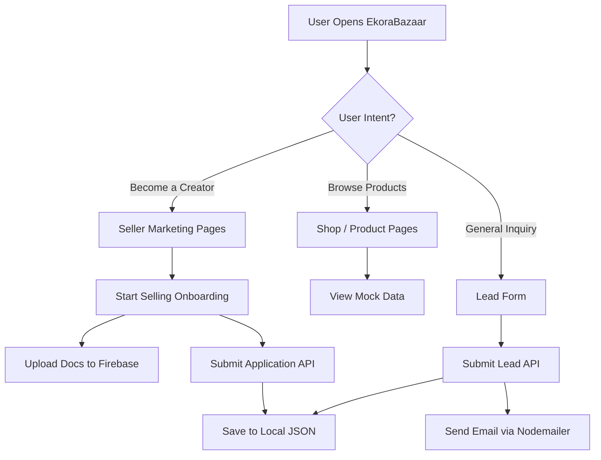
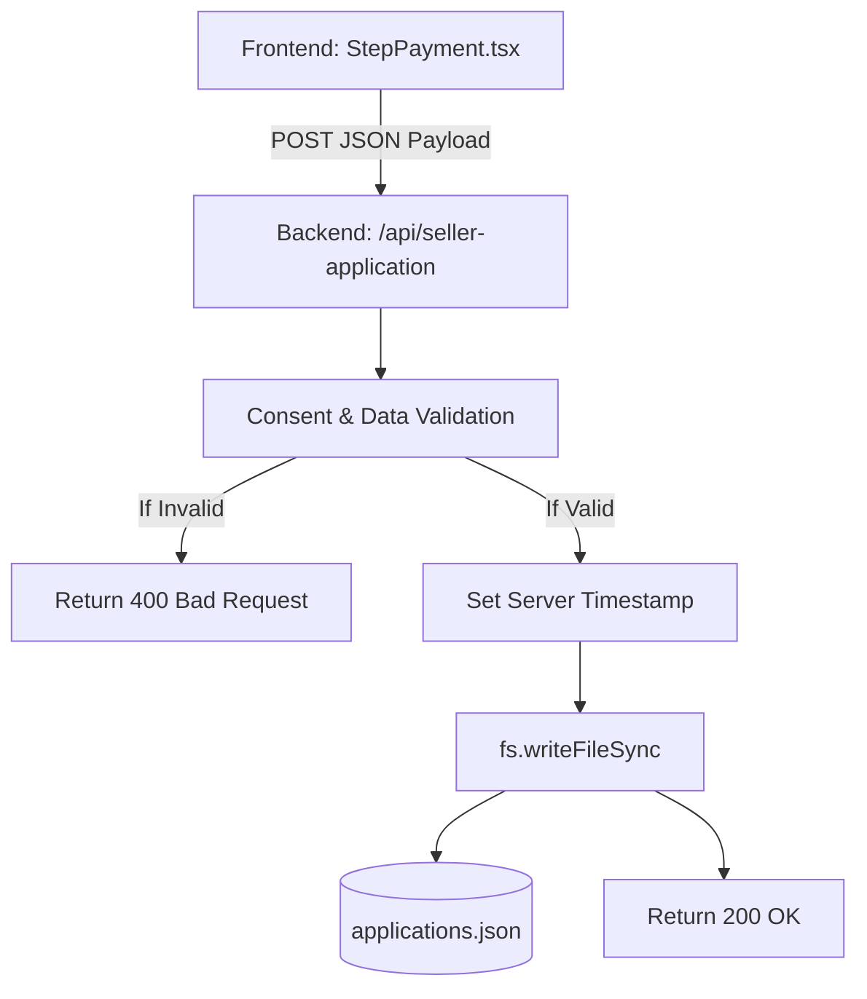
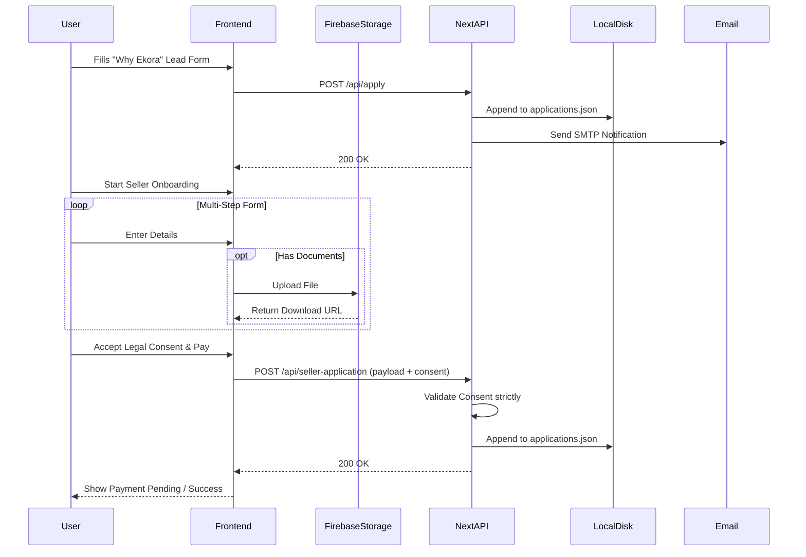

# EkoraBazaar — Application Flow Documentation

## 1. Overall Application Flow

## 2. Landing / Entry Flow
- **User opens application** (e.g. `/` or `/sell`).
- **Initial page loads** static React components.
- **Authentication state** is NOT checked (no auth implemented).
- **Available actions:** Browse classes, navigate to shop, read founder story, or initiate seller onboarding.

## 3. Registration Flow
**Planned / Not Implemented.**
No user account registration exists.

## 4. Login Flow
**Planned / Not Implemented.**
No login system exists.

## 5. User Discovery / Search Flow
- Currently relies on static rendering of JSON data.
- Search capabilities are basic client-side filtering on mock arrays (if implemented in UI). There is no backend search engine.

## 6. Creator / Seller Flow (Onboarding)
This is the most complex implemented flow.
1. **User opens `/start-selling`**.
2. **Context Initiated:** `OnboardingContext` tracks multi-step progress.
3. **Data Entry Steps:** User enters personal details, brand details, categories.
4. **Document Uploads:** In `StepCatalogue`, `StepGST`, and `StepIdentity`, user uploads files.
   - Files are sent directly from the client to **Firebase Storage**.
   - Download URLs are saved in `OnboardingContext`.
5. **Legal Consent (`StepPayment.tsx`):**
   - User must actively check the mandatory consent box.
   - Handled via React state.
6. **Submission:**
   - Client sends JSON payload to `POST /api/seller-application`.
7. **Server Validation:**
   - Validates `mandatoryAccepted === true`.
   - Validates `version === CONSENT_VERSION`.
   - Overwrites timestamp with secure server time.
8. **Persistence:**
   - Server writes the validated object to `applications.json`.
9. **UI Update:**
   - User transitions to final success/pending payment screen.

## 7. Product Flow
- **Discover Product:** User browses `/shop`.
- Data is fetched from `/api/products` (which serves static `mockProducts`).
- **Cart/Checkout Actions:** **Planned / Not Implemented.** UI buttons may exist, but do not trigger actual transactional flows.

## 8. Cart Flow
**Planned / Not Implemented.**

## 9. Checkout Flow
**Planned / Not Implemented.**
(Currently, seller onboarding simulates a "payment pending" step, but no real payment gateway is integrated).

## 10. Order Flow
**Planned / Not Implemented.**

## 11. Profile / Account Flow
**Planned / Not Implemented.**

## 12. Admin Flow
**Planned / Not Implemented.**
No administrative dashboard exists to view the generated `applications.json` files. Admins must manually inspect the server file or check emails.

## 13. API/Data Flow (Seller Application)

## 14. Authentication Data Flow
**Planned / Not Implemented.**

## 15. Error / Failure Flows
- **Invalid Form Data (Client):** User is blocked from proceeding to next step (e.g. missing consent shows red alert text).
- **Missing Consent (API):** If API is hit without valid consent, server returns `400 Bad Request` with strict error message.
- **File System Failure:** If `applications.json` is unwriteable, API catches error and returns `500 Internal Server Error`.
- **Firebase Storage Upload Failure:** Caught by client-side try/catch, sets local React error state so user can retry document upload.
- **Email/SMTP Failure:** If Nodemailer fails during lead generation, error is caught and logged to server console, but API gracefully returns 200 so the user is not blocked (since the data is safely persisted to JSON).

## 16. Complete End-to-End Flow

