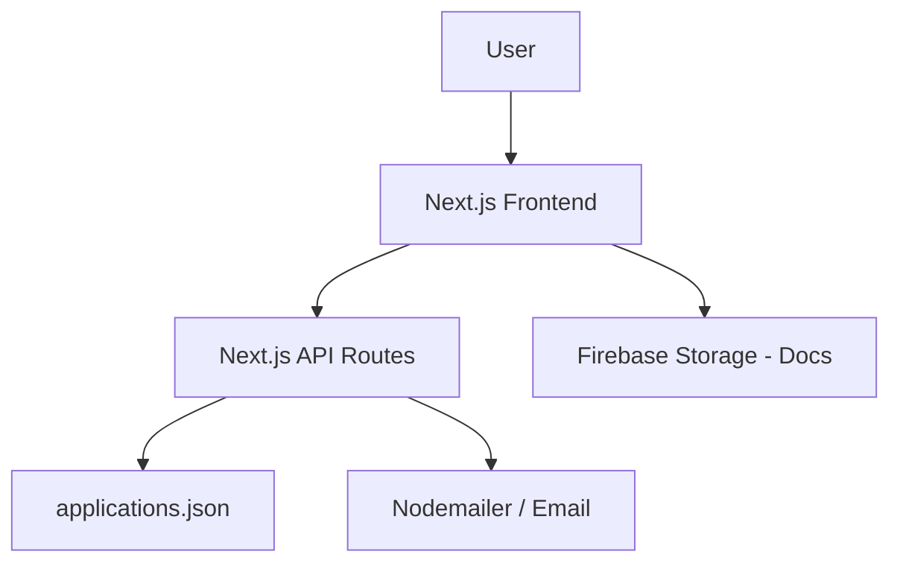

# EkoraBazaar — Function Documentation

## 1. Project Overview
EkoraBazaar is a marketplace platform built for creators to sell products, specifically formulations, bases, and related goods. The main purpose is to onboard "Founding Creators" and collect leads for wholesale and early-access selling. 
Currently, the system acts primarily as a high-quality landing page, product catalog display, and lead generation/onboarding system.
**Major Modules:**
- Landing/Marketing Pages
- Product Catalog & Shop (Mock Data)
- Seller Onboarding (Multi-step form)
- Formulations & Classes display

## 2. System Architecture
- **Frontend:** Next.js 16.2.9 App Router, React 19, Tailwind CSS 4, Framer Motion for animations.
- **Backend:** Next.js API Routes (Node.js runtime).
- **Database / Persistence:** Local JSON files (`applications.json`) for form submissions. Mock JSON data for products.
- **Authentication:** Not Implemented. No user session management exists.
- **File/Storage:** Firebase Storage (used for uploading seller documents).
- **Email:** Nodemailer (SMTP).



## 3. User Roles
**Planned / Not Implemented**
Currently, there is no authentication system, hence no enforced roles. The frontend distinguishes between "Buyers" and "Sellers" structurally (via different landing pages like `/shop` vs `/sell`), but these are not authenticated roles in the system.

## 4. Core Modules

### Seller Onboarding
**Purpose:** Collects applications from potential sellers.
**Files:** 
- `src/app/start-selling/page.tsx`
- `src/app/start-selling/components/steps/*`
- `src/app/start-selling/context/OnboardingContext.tsx`
**Important Functions:**
- `useOnboarding()` (Context): Manages the multi-step state of the seller application.
- `handlePayment()` in `StepPayment.tsx`: Validates legal consent and submits the payload to the API.

### Product Catalog
**Purpose:** Displays available products.
**Files:**
- `src/app/shop/page.tsx`
- `src/lib/data/products.json`
- `src/app/api/products/route.ts`

### Lead Generation
**Purpose:** Collects standard contact/interest forms from the marketing pages.
**Files:**
- `src/app/api/apply/route.ts`

## 5. Frontend Functions
- **Page-level logic:** Server and Client components separated correctly via Next.js App router.
- **State management:** React Context (`OnboardingContext.tsx`) is used for the complex multi-step seller form. Local `useState` for simple UI toggles.
- **Form Validation:** Client-side validation in `StepPayment` ensures mandatory checkboxes are checked before submission.
- **Product Filtering/Sorting:** Mostly static display of mock data.
- **Cart/Checkout:** **Planned / Not Implemented**. (UI might exist in placeholder states, but no functional cart state is persisted).
- **Authentication Handling:** **Not Implemented**.

## 6. Backend Functions

### `POST /api/seller-application`
**File:** `src/app/api/seller-application/route.ts`
**Purpose:** Receives, validates, and stores seller onboarding applications.
**Auth Required:** No
**Validation:**
- Strictly validates `legalConsent.mandatoryAccepted === true`.
- Validates `consent.version` matches `CONSENT_VERSION`.
- Replaces any client-forged timestamp with a secure server-generated timestamp.
**Persistence:** Appends the validated application object to `applications.json` in the root directory.

### `POST /api/apply`
**File:** `src/app/api/apply/route.ts`
**Purpose:** Receives general leads and inquiries.
**Auth Required:** No
**Process:**
- Validates basic fields (email, name based on source).
- Appends lead to `applications.json`.
- Dispatches an email notification via `nodemailer` using SMTP credentials (`SMTP_HOST`, `SMTP_USER`, `SMTP_PASS`).

### `GET /api/products`
**File:** `src/app/api/products/route.ts`
**Purpose:** Returns the static JSON product list.

## 7. Database Functions
**Not Implemented.**
The application does not currently use a relational or NoSQL database (like Postgres, MongoDB, or Firestore).
- **Data Storage:** Submissions are written to a flat local file (`applications.json`).
- **Data Retrieval:** Product data is loaded from static files (`src/lib/data/products.json`, `formulations.json`).

## 8. Authentication & Authorization
**Planned / Not Implemented.**
No login, registration, or session handling currently exists in the codebase.

## 9. API Documentation

| Method | Endpoint | Purpose | Auth Required |
|---|---|---|---|
| POST | `/api/seller-application` | Submit full seller onboarding application | No |
| POST | `/api/apply` | Submit general lead/contact form | No |
| GET | `/api/products` | Retrieve mock product list | No |

## 10. External Integrations
- **Firebase Storage:** 
  - **Purpose:** File uploads for seller documents (GST, Identity). 
  - **Files:** `src/lib/firebase.ts`, `StepGST.tsx`, `StepIdentity.tsx`.
- **Nodemailer (SMTP):**
  - **Purpose:** Email notifications for new leads.
  - **Files:** `src/app/api/apply/route.ts`.

## 11. Error Handling
- **API Errors:** Return structured JSON with `error` messages and 400/500 status codes.
- **Frontend Errors:** React state captures and displays form validation errors (e.g., missing consent in `StepPayment.tsx`). Network failures during fetch are caught and displayed as UI alerts.

## 12. Important Utilities
- `CONSENT_VERSION` (`src/lib/consentVersion.ts`): Single source of truth for the active legal policy version.

## 13. Environment & Configuration
Important placeholders required for execution:
- `NEXT_PUBLIC_FIREBASE_API_KEY`
- `NEXT_PUBLIC_FIREBASE_PROJECT_ID`
- `SMTP_USER`
- `SMTP_PASS`
- `SMTP_HOST`

## 14. Function Dependency Summary
```mermaid
graph LR
    UI[Seller Form UI] --> Context[OnboardingContext]
    Context --> Fetch[fetch POST]
    Fetch --> Route[/api/seller-application]
    Route --> FS[fs.writeFileSync]
    Route --> JSON[applications.json]
```

## 15. Current Implementation Status

| Feature | Status | Relevant Files |
|---|---|---|
| Marketing Pages | Implemented | `src/app/page.tsx`, `src/app/sell/*` |
| Product Catalog | Partial (Mock Data) | `src/app/shop/*`, `src/lib/data/*` |
| Seller Onboarding | Implemented | `src/app/start-selling/*`, `/api/seller-application` |
| Consent Validation | Implemented | `consentVersion.ts`, `/api/seller-application` |
| User Auth / Login | Planned / Not Implemented | N/A |
| Cart & Checkout | Planned / Not Implemented | N/A |
| Admin Dashboard | Planned / Not Implemented | N/A |
| Database Integration | Planned / Not Implemented | N/A |
